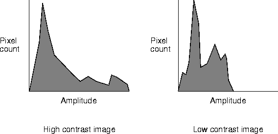
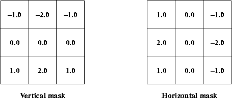
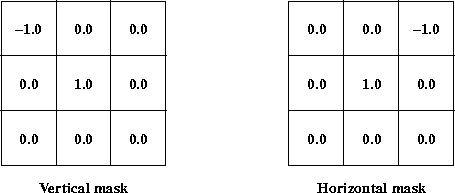
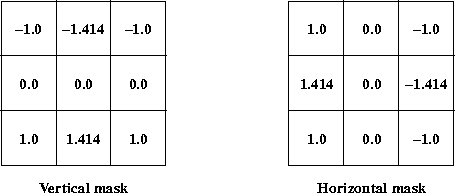

*Programming in Java Advanced Imaging*

\

[]{#55364}

  ----------------------------------------
    C H A P T E R9
  ----------------------------------------

[]{#55366}

+----------------------------------------------------------------------:+
| -------------------------------------------------------------------   |
|                                                                       |
| Image Analysis                                                        |
+-----------------------------------------------------------------------+

 \
 \
 \

 **T**HIS chapter describes the JAI API image analysis operators.

 9.1 Introduction
 -------------------------------------

 The JAI API image analysis operators are used to directly or
 indirectly extract information from an image. The JAI API supports the
 following image analysis functions:

 -   Finding the mean value of an image region

 -   Finding the minimum and maximum values in an image (extrema)

 -   Producing a histogram of an image

 -   Detecting edges in an image

 -   Performing statistical operations

 9.2 Finding the Mean Value of an Image Region
 ------------------------------------------------------------------

 The `Mean` operation scans a specified region of an image and computes
 the image-wise mean pixel value for each band within the region. The
 region of interest does not have to be a rectangle. If no region is
 specified (null), the entire image is scanned to generate the
 histogram. The image data pass through the operation unchanged.

 The `mean` operation takes one rendered source image and three
 parameters:

   ----------------------------------------------------------------------------------------------------------------------------
   [Parameter]{#54846}   [Type]{#54848}       [Description]{#54850}
   --------------------- -------------------- ---------------------------------------------------------------------------------
   [roi]{#54852}\        [ROI]{#54854}\       [The region of the image to scan. A null value means the whole image.]{#54856}\

   [xPeriod]{#54858}\    [Integer]{#54860}\   [The horizontal sampling rate. May not be less than 1.]{#54862}\

   [yPeriod]{#54864}\    [Integer]{#54866}\   [The vertical sampling rate. May not be less than 1.]{#54868}\
   ----------------------------------------------------------------------------------------------------------------------------

   : 

 The region of interest (ROI) does not have to be a rectangle. It may
 be `null`, in which case the entire image is scanned to find the
 image-wise mean pixel value for each band.

 The set of pixels scanned may be reduced by specifying the `xPeriod`
 and `yPeriod` parameters, which define the sampling rate along each
 axis. These variables may not be less than 1. However, they may be
 `null`, in which case the sampling rate is set to 1; that is, every
 pixel in the ROI is processed.

 The image-wise mean pixel value for each band may be retrieved by
 calling the `getProperty` method with `"mean"` as the property name.
 The return value has type `java.lang.Number[#bands]`.

 [Listing 9-1](Analysis.doc.html#56522) shows a partial code sample of
 finding the image-wise mean pixel value of an image in the rendered
 mode.

 **[]{#56522}**

 ***Listing 9-1*  Finding the Mean Value of an
 Image Region**

 ------------------------------------------------------------------------

          // Set up the parameter block for the source image and
          // the three parameters.
          ParameterBlock pb = new ParameterBlock();
          pb.addSource(im);   // The source image
          pb.add(null);       // null ROI means whole image
          pb.add(1);          // check every pixel horizontally
          pb.add(1);          // check every pixel vertically

          // Perform the mean operation on the source image.
          RenderedImage meanImage = JAI.create("mean", pb, null);

          // Retrieve and report the mean pixel value.
          double[] mean = (double[])meanImage.getProperty("mean");
          System.out.println("Band 0 mean = " + mean[0]);

 ------------------------------------------------------------------------

 9.3 Finding the Extrema of an Image
 --------------------------------------------------------

 The `Extrema` operation scans a specific region of a rendered image
 and finds the image-wise minimum and maximum pixel values for each
 band within that region of the image. The image pixel data values pass
 through the operation unchanged. The `extrema` operation can be used
 to obtain information to compute the scale and offset factors for the
 amplitude rescaling operation (see [Section 7.4, \"Amplitude
 Rescaling](Image-enhance.doc.html#76502)\").

 The region-wise maximum and minimum pixel values may be obtained as
 properties. Calling the `getProperty` method on this operation with
 `"extrema"` as the property name retrieves both the region-wise
 maximum and minimum pixel values. Calling it with `"maximum"` as the
 property name retrieves the region-wise maximum pixel value, and with
 `"minimum"` as the property name retrieves the region-wise minimum
 pixel value.

 The return value for `extrema` has type `double[2][#bands]`, and those
 for `maximum` and `minimum` have type `double[#bands]`.

 The region of interest (ROI) does not have to be a rectangle. It may
 be `null`, in which case the entire image is scanned to find the
 image-wise maximum and minimum pixel values for each band.

 The `extrema` operation takes one rendered source image and three
 parameters:

   --------------------------------------------------------------------------------------------------------------
   [Parameter]{#54912}   [Type]{#54914}       [Description]{#54916}
   --------------------- -------------------- -------------------------------------------------------------------
   [roi]{#54918}\        [ROI]{#54920}\       [The region of the image to scan.]{#54922}\

   [xPeriod]{#54924}\    [Integer]{#54926}\   [The horizontal sampling rate (may not be less than 1).]{#54928}\

   [yPeriod]{#54930}\    [Integer]{#54932}\   [The vertical sampling rate (may not be less than 1).]{#54934}\
   --------------------------------------------------------------------------------------------------------------

   : 

 The set of pixels scanned may be further reduced by specifying the
 `xPeriod` and `yPeriod` parameters that represent the sampling rate
 along each axis. These variables may not be less than 1. However, they
 may be `null`, in which case the sampling rate is set to 1; that is,
 every pixel in the ROI is processed.

 [Listing 9-2](Analysis.doc.html#56559) shows a partial code sample of
 using the `extrema` operation to obtain both the image-wise maximum
 and minimum pixel values of the source image.

 **[]{#56559}**

 ***Listing 9-2*  Finding the Extrema of an
 Image**

 ------------------------------------------------------------------------

          // Set up the parameter block for the source image and
          // the constants
          ParameterBlock pb = new ParameterBlock();
          pb.addSource(im);   // The source image
          pb.add(roi);        // The region of the image to scan
          pb.add(50);         // The horizontal sampling rate
          pb.add(50);         // The vertical sampling rate

          // Perform the extrema operation on the source image
          RenderedOp op = JAI.create("extrema", pb);

          // Retrieve both the maximum and minimum pixel value
          double[][] extrema = (double[][]) op.getProperty("extrema");

 ------------------------------------------------------------------------

 9.4 Histogram Generation
 ---------------------------------------------

 An image histogram is an analytic tool used to measure the amplitude
 distribution of pixels within an image. For example, a histogram can
 be used to provide a count of the number of pixels at amplitude 0, the
 number at amplitude 1, and so on. By analyzing the distribution of
 pixel amplitudes, you can gain some information about the visual
 appearance of an image. A high-contrast image contains a wide
 distribution of pixel counts covering the entire amplitude range. A
 low contrast image has most of the pixel amplitudes congregated in a
 relatively narrow range.

 Usually, the wider histogram represents a more visually-appealing
 image.

 ------------------------------------------------------------------------

 

 ------------------------------------------------------------------------

 ***Figure 9-1*  Example Histograms**

 The primary tasks needed to perform a histogram operation are as
 follows:

 1\. Create a `Histogram` object, which specifies the type of histogram to
 be generated.

 2\. Create a `Histogram` operation with the required parameters or create
 a `ParameterBlock` with the parameters and pass it to the `Histogram`
 operation.

 3\. Read the histogram data stored in the object. The data consists of:

 -   Number of bands in the histogram

 -   Number of bins for each band of the image

 -   Lowest value checked for each band

 -   Highest value checked for each band

 ### 9.4.1 Specifying the Histogram

 The `Histogram` object accumulates the histogram information. A
 histogram counts the number of image samples whose values lie within a
 given range of values, or \"bins.\" The source image may be of any
 data type.

 The `Histogram` contains a set of bins for each band of the image.
 These bins hold the information about gray or color levels. For
 example, to take the histogram of an eight-bit grayscale image, the
 `Histogram` might contain 256 bins. When reading the `Histogram`, bin
 0 will contain the number of 0\'s in the image, bin 1 will contain the
 number of 1\'s, and so on.

 The `Histogram` need not contain a bin for every possible value in the
 image. It is possible to specify the lowest and highest values that
 will result in a bin count being incremented. It is also possible to
 specify fewer bins than the number of levels being checked. In this
 case, each bin will hold the count for a range of values. For example,
 for a `Histogram` with only four bins used with an 8-bit grayscale
 image, the number of occurrences of values 0 through 63 will be stored
 in bin 0, occurrences of values 64 through 127 will be stored in bin
 1, and so on.

 The `Histogram` object takes three parameters:

   -----------------------------------------------------------------------------------------------------------------------------------------------------------------------------------------------------------------------------------------------------------
   [Parameter]{#55182}    [Description]{#55184}
   ---------------------- ------------------------------------------------------------------------------------------------------------------------------------------------------------------------------------------------------------------------------------
   [numBins]{#55186}\     [An array of ints, each element of which specifies the number of bins to be used for one band of the image. The number of elements in the array must match the number of bands in the image.]{#55188}\

   [lowValue]{#55190}\    [An array of floats, each element of which specifies the lowest gray or color level that will be checked for in one band of the image. The number of elements in the array must match the number of bands in the image.]{#55192}\

   [highValue]{#55194}\   [An array of floats, each element of which specifies the highest gray or color level that will be checked for in one band of the image. The number of elements in the array must match the number of bands in the image.]{#55196}\
   -----------------------------------------------------------------------------------------------------------------------------------------------------------------------------------------------------------------------------------------------------------

   : 

 For an example histogram, see [Listing 9-3 on page
 315](Analysis.doc.html#56595).

 +-----------------------------------+-----------------------------------+
 |            | -------------------------------   |
 |                                   |                                   |
 |                                   | **API:**                          |
 |                                   | `javax.media.jai.Histogram`       |
 |                                   |                                   |
 |                                   | -------------------------------   |
 +-----------------------------------+-----------------------------------+

     Histogram(int[] numBins, float[] lowValue, float[] highValue)

 :   constructs a `Histogram` that may be used to accumulate data
     within a given range for each band of an image. The legal pixel
     range and the number of bins may be controlled separately.
     *Parameters*:
     `numBins`
     The number of bins for each band of the image; `numBins.length`
     must be equal to the number of bands of the image which the
     histogram is taken.
     `lowValue`
     The lowest pixel value checked for each band.
     `highValue`
     The highest pixel value checked for each band. Note when counting
     the pixel values, this `highValue` is not included based on the
     formula below.
    

 :   If `binWidth` is defined as (`highValue` - `lowValue`)/`numBins`,
     bin i will count pixel values in the range from
    

 :   

 ### 9.4.2 Performing the Histogram Operation

 Once you have created the `Histogram` object to accumulate the
 histogram information, you generate the histogram for an image with
 the `histogram` operation. The `histogram` operation scans a specified
 region of an image and generates a histogram based on the pixel values
 within that region of the image. The region of interest does not have
 to be a rectangle. If no region is specified (null), the entire image
 is scanned to generate the histogram. The image data passes through
 the operation unchanged.

 The `histogram` operation takes one rendered source image and four
 parameters:

   -------------------------------------------------------------------------------------------------------------------------------------------------------------------------------------------------------
   [Parameter]{#52625}        [Type]{#52627}         [Description]{#52629}
   -------------------------- ---------------------- -----------------------------------------------------------------------------------------------------------------------------------------------------
   [specification]{#52631}\   [Histogram]{#52633}\   [The specification for the type of histogram to be generated. See]{#52635} [Section 9.4.1, \"Specifying the Histogram](Analysis.doc.html#55111).\"\

   [roi]{#52637}\             [ROI]{#52639}\         [The region of the image to scan. See]{#52641} [Section 6.2, \"Region of Interest Control](Image-manipulation.doc.html#51458).\"\

   [xPeriod]{#52643}\         [Integer]{#52645}\     [The horizontal sampling rate. May not be less than 1.]{#52647}\

   [yPeriod]{#52649}\         [Integer]{#52651}\     [The vertical sampling rate. May not be less than 1.]{#52653}\
   -------------------------------------------------------------------------------------------------------------------------------------------------------------------------------------------------------

   : 

 The set of pixels scanned may be further reduced by specifying the
 `xPeriod` and `yPeriod` parameters that represent the sampling rate
 along each axis. These variables may not be less than 1. However, they
 may be null, in which case the sampling rate is set to 1; that is,
 every pixel in the ROI is processed.

 ### 9.4.3 Reading the Histogram Data

 The histogram data is stored in the user supplied `Histogram` object,
 and may be retrieved by calling the `getProperty` method on this
 operation with `"histogram"` as the property name. The return value
 will be of type `Histogram`.

 Several get methods allow you to check on the four histogram
 parameters:

 -   The bin data for all bands (`getBins`)``

 -   The bin data for a specified band (`getBins`)

 -   The number of pixel values found in a given bin for a given band
     (`getBinSize`)

 -   The lowest pixel value found in a given bin for a given band
     (`getBinLowValue`)

 The set of pixels counted in the histogram may be limited by the use
 of a region of interest (ROI), and by horizontal and vertical
 subsampling factors. These factors allow the accuracy of the histogram
 to be traded for speed of computation.

 +-----------------------------------+-----------------------------------+
 |            | -------------------------------   |
 |                                   |                                   |
 |                                   | **API:**                          |
 |                                   | `javax.media.jai.Histogram`       |
 |                                   |                                   |
 |                                   | -------------------------------   |
 +-----------------------------------+-----------------------------------+

     int[][] getBins()

 :   returns the bins of the histogram for all bands.

     int[] getBins(int band)

 :   returns the bins of the histogram for a specified band.
       --------------- -------- ------------------------
       *Parameters*:   `band`   The band to be checked
       --------------- -------- ------------------------

       : 

     int getBinSize(int band, int bin)

 :   returns the number of pixel values found in a given bin for a
     given band.
     *Parameters*:
     `band`
     The band to be checked
     `bin`
     The bin to be checked

     float getBinLowValue(int band, int bin)

 :   returns the lowest pixel value found in a given bin for a given
     band.
     *Parameters*:
     `band`
     The band to be checked
     `bin`
     The bin to be checked

     void clearHistogram()

 :   resets the counts of all bins to zero.

     void countPixels(java.awt.image.Raster pixels, ROI roi,
            int xStart, int yStart, int xPeriod, int yPeriod)

 :   adds the pixels of a `Raster` that lie within a given region of
     interest (ROI) to the histogram. The set of pixels is further
     reduced by subsampling factors in the horizontal and vertical
     directions. The set of pixels to be accumulated may be obtained by
     intersecting the grid
    

 :   
    

 :   with the region of interest and the bounding rectangle of the
     `Raster`.
     *Parameters*:
     `pixels`
     A Raster containing pixels to be histogrammed.
     `roi`
     The region of interest, as a ROI.
     `xStart`
     The initial *x* sample coordinate.
     `yStart`
     The initial *y* sample coordinate.
     `xPeriod`
     The *x* sampling rate.
     `yPeriod`
     The *y* sampling rate.

 ### 9.4.4 Histogram Operation Example

 [Listing 9-3](Analysis.doc.html#56595) shows a sample listing for a
 histogram operation on a three-banded source image.

 **[]{#56595}**

 ***Listing 9-3*  Example Histogram Operation**

 ------------------------------------------------------------------------

          // Set up the parameters for the Histogram object.
          int[] bins = {256, 256, 256};             // The number of bins.
          double[] low = {0.0D, 0.0D, 0.0D};        // The low value.
          double[] high = {256.0D, 256.0D, 256.0D}; // The high value.

          // Construct the Histogram object.
          Histogram hist = new Histogram(bins, low, high);

          // Create the parameter block.
          ParameterBlock pb = new ParameterBlock();
          pb.addSource(image);               // Specify the source image
          pb.add(hist);                      // Specify the histogram
          pb.add(null);                      // No ROI
          pb.add(1);                         // Sampling
          pb.add(1);                         // periods

          // Perform the histogram operation.
          dst = (PlanarImage)JAI.create("histogram", pb, null);

          // Retrieve the histogram data.
          hist = (Histogram) dst.getProperty("histogram");

          // Print 3-band histogram.
          for (int i=0; i< histogram.getNumBins(); i++) {
             System.out.println(hist.getBinSize(0, i) + " " +
                                hist.getBinSize(1, i) + " " +
                                hist.getBinSize(2, i) + " " +
          }

 ------------------------------------------------------------------------

 9.5 Edge Detection
 ---------------------------------------

 Edge detection is useful for locating the boundaries of objects within
 an image. Any abrupt change in image frequency over a relatively small
 area within an image is defined as an edge. Image edges usually occur
 at the boundaries of objects within an image, where the amplitude of
 the object abruptly changes to the amplitude of the background or
 another object.

 The `GradientMagnitude` operation is an edge detector that computes
 the magnitude of the image gradient vector in two orthogonal
 directions. This operation is used to improve an image by showing the
 directional information only for those pixels that have a strong
 magnitude for the brightness gradient.

 -   It performs two convolution operations on the source image. One
     convolution detects edges in one direction, the other convolution
     detects edges the orthogonal direction. These two convolutions
     yield two intermediate images.

 -   It squares all the pixel values in the two intermediate images,
     yielding two more intermediate images.

 -   It takes the square root of the last two images forming the final
     image.

 The result of the `GradientMagnitude` operation may be defined as:

 :   
    

 :   where `SH(x,y,b)` and `SV(x,y,b)` are the horizontal and vertical
     gradient images generated from band *b* of the source image by
     correlating it with the supplied orthogonal (horizontal and
     vertical) gradient masks.

 The `GradientMagnitude` operation uses two gradient masks; one for
 passing over the image in each direction. The `GradientMagnitude`
 operation takes one rendered source image and two parameters.

   ------------------------------------------------------------------------------------------------------
   [Parameter]{#56095}   [Type]{#56097}         [Description]{#56099}
   --------------------- ---------------------- ---------------------------------------------------------
   [mask1]{#56101}\      [KernelJAI]{#56103}\   [A gradient mask.]{#56105}\

   [mask2]{#56107}\      [KernelJAI]{#56109}\   [A gradient mask orthogonal to the first one.]{#56111}\
   ------------------------------------------------------------------------------------------------------

   : 

 The default masks for the `GradientMagnitude` operation are:

 -   `KernelJAI.GRADIENT_MASK_SOBEL_HORIZONTAL`

 -   `KernelJAI.GRADIENT_MASK_SOBEL_VERTICAL`

 These masks, shown in [Figure 9-2](Analysis.doc.html#51239) perform
 the Sobel edge enhancement operation. The Sobel operation extracts all
 of the edges in an image, regardless of the direction. The resulting
 image appears as an omnidirectional outline of the objects in the
 original image. Constant brightness regions are highlighted.

 ------------------------------------------------------------------------

 

 ------------------------------------------------------------------------

 ***Figure 9-2*  Sobel Edge Enhancement Masks**

 The Roberts\' cross edge enhancement operation uses the two masks
 shown in [Figure 9-3](Analysis.doc.html#57055). This operation
 extracts edges in an image by taking the combined differences of
 directions at right angles to each other to determine the gradient.
 The resulting image appears as a fairly-coarse directional outline of
 the objects within the image. Constant brightness regions become black
 and changing brightness regions become highlighted. The following is a
 listing of how the two masks are constructed.

 ------------------------------------------------------------------------

          float[] roberts_h_data        = { 0.0F,  0.0F, -1.0F,
                                            0.0F,  1.0F,  0.0F,
                                            0.0F,  0.0F,  0.0F
          };
          float[] roberts_v_data        = {-1.0F,  0.0F,  0.0F,
                                            0.0F,  1.0F,  0.0F,
                                            0.0F,  0.0F,  0.0F
          };

          KernelJAI kern_h = new KernelJAI(3,3,roberts_h_data);
          KernelJAI kern_v = new KernelJAI(3,3,roberts_v_data);

 ------------------------------------------------------------------------

 ------------------------------------------------------------------------

 

 ------------------------------------------------------------------------

 ***Figure 9-3*  Roberts\' Cross Edge
 Enhancement Masks**

 The Prewitt gradient edge enhancement operation uses the two masks
 shown in [Figure 9-4](Analysis.doc.html#57129). This operation
 extracts the north, northeast, east, southeast, south, southwest,
 west, or northwest edges in an image. The resulting image appears as a
 directional outline of the objects within the image. Constant
 brightness regions become black and changing brightness regions become
 highlighted. The following is a listing of how the two masks are
 constructed.

 ------------------------------------------------------------------------

          float[] prewitt_h_data        = { 1.0F,  0.0F, -1.0F,
                                            1.0F,  0.0F, -1.0F,
                                            1.0F,  0.0F, -1.0F
          };
          float[] prewitt_v_data        = {-1.0F, -1.0F, -1.0F,
                                            0.0F,  0.0F,  0.0F,
                                            1.0F,  1.0F,  1.0F
          };

          KernelJAI kern_h = new KernelJAI(3,3,prewitt_h_data);
          KernelJAI kern_v = new KernelJAI(3,3,prewitt_v_data);

 ------------------------------------------------------------------------

 ------------------------------------------------------------------------

 

 ------------------------------------------------------------------------

 ***Figure 9-4*  Prewitt Edge Enhancement
 Masks**

 The Frei and Chen edge enhancement operation uses the two masks shown
 in [Figure 9-5](Analysis.doc.html#57203). This operation, when
 compared to the other edge enhancement, operations, is more sensitive
 to a configuration of relative pixel values independent of the
 brightness magnitude. The following is a listing of how the two masks
 are constructed.

 ------------------------------------------------------------------------

          float[] freichen_h_data        = { 1.0F,   0.0F,   -1.0F,
                                             1.414F, 0.0F,   -1.414F,
                                             1.0F,   0.0F,   -1.0F
          };
          float[] freichen_v_data        = {-1.0F,  -1.414F, -1.0F,
                                             0.0F,   0.0F,    0.0F,
                                             1.0F,   1.414F,  1.0F
          };

          KernelJAI kern_h = new KernelJAI(3,3,freichen_h_data);
          KernelJAI kern_v = new KernelJAI(3,3,freichen_v_data);

 ------------------------------------------------------------------------

 ------------------------------------------------------------------------

 

 ------------------------------------------------------------------------

 ***Figure 9-5*  Frei and Chen Edge Enhancement
 Masks**

 To use a different mask, see [Section 6.9, \"Constructing a
 Kernel](Image-manipulation.doc.html#70882).\"

 [Listing 9-4](Analysis.doc.html#56654) shows a sample listing for a
 `GradientMagnitude` operation, using the Frei and Chen edge detection
 kernel.

 **[]{#56654}**

 ***Listing 9-4*  Example GradientMagnitude
 Operation**

 ------------------------------------------------------------------------

          // Load the image.
          PlanarImage im0 = (PlanarImage)JAI.create("fileload",
                                                    filename);

          // Create the two kernels.
          float data_h[] = new float[] { 1.0F,   0.0F,   -1.0F,
                                         1.414F, 0.0F,   -1.414F,
                                         1.0F,   0.0F,   -1.0F};
          float data_v[] = new float[] {-1.0F,  -1.414F, -1.0F,
                                         0.0F,   0.0F,    0.0F,
                                         1.0F,   1.414F,  1.0F};

          KernelJAI kern_h = new KernelJAI(3,3,data_h);
          KernelJAI kern_v = new KernelJAI(3,3,data_v);

          // Create the Gradient operation.
          PlanarImage im1 =
                  (PlanarImage)JAI.create("gradientmagnitude", im0,
                                           kern_h, kern_v);

          // Display the image.
          imagePanel = new ScrollingImagePanel(im1, 512, 512);
                  add(imagePanel);
                  pack();
                  show();

 ------------------------------------------------------------------------

 9.6 Statistical Operations
 -----------------------------------------------

 The `StatisticsOpImage` class is an abstract class for image operators
 that compute statistics on a given region of an image and with a given
 sampling rate. A subclass of `StatisticsOpImage` simply passes pixels
 through unchanged from its parent image. However, the desired
 statistics are available as a property or set of properties on the
 image (see [Chapter 11, \"Image
 Properties](Properties.doc.html#47285)\").

 All instances of `StatisticsOpImage` make use of a region of interest,
 specified as an `ROI` object. Additionally, they may perform spatial
 subsampling of the region of interest according to `xPeriod` and
 `yPeriod` parameters that may vary from 1 (sample every pixel of the
 `ROI`) upwards. This allows the speed and quality of statistics
 gathering to be traded off against one another.

 The `accumulateStatistics` method is used to accumulate statistics on
 a specified region into the previously-created statistics object.``

 +-----------------------------------+-----------------------------------+
 |            | -------------------------------   |
 |                                   |                                   |
 |                                   | **API:**                          |
 |                                   | `javax.media.jai.StatisticsOpImag |
 |                                   | e`                                |
 |                                   |                                   |
 |                                   | -------------------------------   |
 +-----------------------------------+-----------------------------------+

     StatisticsOpImage()

 :   constructs a default `StatisticsOpImage`.

     StatisticsOpImage(RenderedImage source, ROI roi, int xStart, 
            int yStart, int xPeriod, int yPeriod, int maxWidth, 

            int maxHeight)

 :   constructs a `StatisticsOpImage`. The image layout is copied from
     the source image.
     *Parameters*:
     `source`
     A `RenderedImage`.
     `roi`
     The region of interest, as an `ROI`.
     `xStart`
     The initial *x* sample coordinate.
     `ystart`
     The initial *y* sample coordinate.
     `xPeriod`
     The *x* sampling rate.
     `yPeriod`
     The *y* sampling rate.
     `maxWidth`
     The largest allowed width for processing.
     `maxHeight`
     The largest allowed height for processing.

 ------------------------------------------------------------------------

 \

 
 
 

 *Programming in Java Advanced Imaging*

 \

 ##### [Copyright](copyright.html) © 1999, Sun Microsystems, Inc. All rights reserved.
