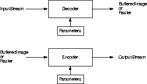
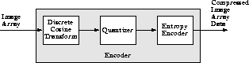
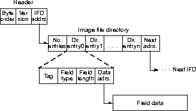

# Image Data Codecs

This appendix describes the ImageN image data compression coders and decoders (codecs).

These are the original JAI Codecs which have been superseded by the Java and ImageIO implementations.

These are provided as a legacy-codec-core dependency for applications wishing to maintain backwards compatibility.

```xml
   <dependency>
     <groupId>org.eclipse.imagen</groupId>
     <artifactId>imagen-legacy-codec-core</artifactId>
     <version>0.9.2-SNAPSHOT</version>
   </dependency>
```

C.1 Introduction
--------------------------------------

The `org.eclipse.imagen.codec` package provides a set of interfaces and
classes for encoding and decoding compressed image data files. ImageN
supports the following codecs:

| Codec | Description |
| ----- | ------------|
| BMP   | Microsoft Windows bitmap image file format |
| FPX   | FlashPix by the Digital Imaging Group (DIG) |
| JPEG  |    [Joint Photographic Experts Group (JPEG) format |
| PNG   |   Portable Network Graphics file format |
| PNM   | Portable aNy Map file format |

The `org.eclipse.imagen.codec` package also enables you to create your
own additional codecs if those listed above are not sufficient. See
[Chapter 12, \"Extending the API](../extension),\" for
more information.

The ImageN codecs are used to both read (decode) and
write (encode) compressed images. Decode operations convert compressed
image data back into the uncompressed form. Encode operations convert
original image data into a compressed data form. These are often
called *image coding* operations, because they use data coding methods
to make the conversion to and from the compressed form.

As shown in [Figure C-1](Compression.doc.anc.gif), the image
decode operations transform an `InputStream` into a `BufferedImage` or
`Raster` object. The image encode operations transform a
`BufferedImage` or `Raster` into an `OutputStream`. Various parameters
affect the encode and decode operations. These parameters are usually
different for each codec, but include such things as the bit depth,
choice of conversion tables, and factors that affect image quality and
compression ratio.



If you need to know more about image data compression than is
presented here, see "[Related Documentation](../preface/#related)" in the Preface.


C.2 Interfaces and Classes
------------------------------------------------

The following tables list the interfaces and classes used for image
data compression and decompression. These interfaces and classes are
all part of the `org.eclipse.imagen.codec` package.

**Table C-1 Codec Interfaces** <a name="table-C-1"></a>

| Interface | Description |
| ----- | ------------|
| ImageDecoder  | Describes objects that transform an InputStream into a BufferedImage or Raster. |
| ImageEncoder  | Describes objects that transform a BufferedImage or Raster into an OutputStream. |
| ImageDecodeParam  | Extends: `java.lang.Cloneable`  <br/> An empty (marker) interface to be implemented by all image decoder parameter classes. |
| ImageEncodeParam  | Extends: `ImageDecodeParam`, `java.lang.Cloneable` <br/> An empty (marker) interface to be implemented by all image encoder parameter classes. |

**Table C-2 Codec Classes** <a name="table-C-2"></a>

| Class  | Description  |
| ------ | ------------ |
| ImageCodec  | Extends: `java.lang.Object`  <br/> Allows the creation of image decoders and encoders. Instances of ImageCodec may be registered by name. Once a codec has been registered, the name associated with it may be used as the name parameter in the createImageEncoder and createImageDecoder methods. |
| ImageDecoderImpl  | Extends: `java.lang.Object`  <br/> Implements: `ImageDecoder`  <br/> An implementation of the ImageDecoder interface useful for subclassing. |
| ImageEncoderImpl  | Extends: `java.lang.Object`  <br/> Implements: `ImageEncoder`  <br/> An implementation of the ImageEncoder interface useful for subclassing. |
| BMPEncodeParam  | Extends: `java.lang.Object`  <br/> Implements: `ImageEncodeParam`  <br/> Specifies parameters for encoding BMP format image files. |
| JPEGEncodeParam  | Extends: `java.lang.Object`  <br/> Implements: `ImageEncodeParam`, `com.sun.image.codec.jpeg.JPEGEncodeParam`  <br/> Specifies parameters for encoding JPEG format image files. |
| PNMEncodeParam  | Extends: `java.lang.Object`  <br/> Implements: `ImageEncodeParam`  <br/> Specifies parameters for encoding PNM format image files. |

C.3 Encoding a Compressed Image File
----------------------------------------------------------

The encoding operation is usually performed at the sink end of a
rendering graph or chain, after any other operations have been
performed and the image is converted into a `RenderedImage` or a
`Raster`. At this point, the image is ready to be written to a file in
one of the supported compressed image data formats.

The encoding of an image file into a supported image format is done
with one of the `ImageCodec.createImageEncoder` methods. To encode a
compressed image file, you:

```java
RenderedImage im;
String filename;

FileOutputStream dst = new FileOutputStream(filename)

ImageEncoder enc =
    ImageCodec.createImageEncoder("codec", dst, null);
```

The "codec" parameter specifies the name of the codec to be used ("BMP", "JPEG", "PNG", or "PNM"). The dst parameter specifies the OutputStream to write to.

```java
enc.encode(im);
dst.close();
```

The following sample code is an example of encoding a BMP file.


------------------------------------------------------------------------

```java
RenderedImage im;
String filename;

FileOutputStream dst = new FileOutputStream(filename)
ImageEncoder enc =
    ImageCodec.createImageEncoder("BMP", dst, null);
enc.encode(im);
dst.close();
```

------------------------------------------------------------------------

**API:** `org.eclipse.imagen.codec.ImageCodec`  

Returns an `ImageEncoder` object suitable for encoding to the supplied `OutputStream`, using the supplied `ImageEncodeParam` object.

```
    static ImageEncoder createImageEncoder(java.lang.String name, 
                                           java.io.OutputStream dst,
                                           ImageEncodeParam param)
```


**API:** `org.eclipse.imagen.codec.ImageEncoder`

```
    void encode(java.awt.image.Raster ras)
    void encode(java.awt.image.RenderedImage im)
```


C.4 Decoding a Compressed Image File
----------------------------------------------------------

The decoding operation is usually performed at the source end of a
rendering graph or chain, before any other operations have been
performed.

The decoding of any of the supported image formats is done with one of
the `ImageCodec.createImageDecoder` methods. To decode a compressed
image file, you:

The following sample code is an example of decoding a JPEG file.


------------------------------------------------------------------------
```java
RenderedImage im;
String filename;

FileInputStream dst = new FileInputStream(filename)
ImageDecoder dec =
    ImageCodec.createImageDecoder("JPEG", dst, null);
enc.decode(im);
dst.close();
```
------------------------------------------------------------------------

**API:** `org.eclipse.imagen.codec.ImageCodec`

```
    static ImageEncoder createImageEncoder(java.lang.String name, 
                                           java.io.OutputStream dst,
                                           ImageEncodeParam param)
    static ImageEncoder createImageEncoder(java.lang.String name, 
                                           java.io.OutputStream dst)
```

**API:** `org.eclipse.imagen.codec.ImageEncoder`

```
    void encode(java.awt.image.Raster ras)
    void encode(java.awt.image.RenderedImage im)
```

C.5 Standard Image Compression Schemes
------------------------------------------------------------

Several standardized image compression techniques have evolved to
support the requirements of different segments of the imaging
industry. Java Advanced Imaging supports a small number of these
standards. Due to the great variety of standards available, it is not
possible for any imaging API to support them all. However, Java
Advanced Imaging makes it possible to add any number of image coders
and decoders to support special needs. See [Chapter 12, \"Extending
the API](../extension),\" for more information.


### C.5.1 BMP Coding

The BMP (Microsoft Windows bitmap image file) file format is a
commonly-used file format on IBM PC-compatible computers. BMP files
can also refer to the OS/2 bitmap format, which is a strict superset
of the Windows format. The OS/2 2.0 format allows for multiple bitmaps
in the same file, for the CCITT G3 1bpp encoding, and also a RLE24
encoding.

Java Advanced Imaging currently reads and writes Version2, Version3,
and some of the Version 4 images, as defined in the Microsoft Windows
BMP file format.

Version 4 of the BMP format allows for the specification of alpha
values, gamma values, and CIE color spaces. These are not currently
handled, but the relevant properties are emitted, if they are
available from the BMP image file.

Versions 3 and later support run-length encoded (RLE) formats for
compressing bitmaps that use four or eight bits per pixel.

BMP files are stored in a device-independent bitmap (DIB) format that
allows the bitmap to be displayed on any type of display device. The
format specifies pixel color in a form independent of the method used
by a display to represent color.

The BMP file contains the following:

-   Bitmap-file header - describes the type, size, and layout of the
    bitmap file.


-   Bitmap-information header - specifies the dimensions, compressed
    type, and color format for the bitmap.


-   Color table - an array of RGB quad structures that describe a
    color consisting of relative intensities of red, green, and blue.
    The array contains as many elements as there are colors in the
    bitmap. There is no color table for bitmaps with 24 color bits
    since each pixel is represented by 24-bit red-green-blue (RGB)
    values in the actual bitmap data area.


-   Bitmap data - an array of bytes that defines the bitmap bits. The
    bytes represent consecutive rows (or *scan lines*) of the bitmap.
    Each scan line consists of consecutive bytes representing the
    pixels in the scan line, in left-to-right order. The number of
    bytes representing a scan line depends on the color format and the
    width, in pixels, of the bitmap.

The bit count information in the bitmap-information header determines
the number of bits that define each pixel and the maximum number of
colors in the bitmap. The bit count information can have any of the
following values:

| Value  | Description |
| ------ | ----------- 
| 1  | Bitmap is monochrome and the color table contains two entries. Each bit in the bitmap array represents a pixel. |
| 4  | Bitmap has a maximum of 16 colors. Each pixel in the bitmap is represented by a four-bit index into the color table. |
| 8  | Bitmap has a maximum of 256 colors. Each pixel in the bitmap is represented by a one-byte index into the color table. |
| 24  | Bitmap has a maximum of 2^24^ colors - each three-byte sequence in the bitmap array represents the relative intensities of red, green, and blue, respectively, for a pixel. |


#### C.5.1.1 BMP Coding Parameters

Java Advanced Imaging provides four parameters for defining BMP
coding: version, compression type, data layout, and the number of bits
per pixel.


#### C.5.1.2 BMP Version

Java Advanced Imaging currently reads and writes Version2, Version3,
and some of the Version 4 images. The BMP version number is read and
specified with `getVersion` and `setVersion` methods in the
`BMPEncodeParam` class. The BMP version parameters are as follows:

| Parameter  | Description  |
| ---------- | ------------ |
| VERSION_2  | Specifies BMP Version 2 |
| VERSION_3  | Specifies BMP Version 3 |
| VERSION_4  | Specifies BMP Version 4 |

If not specifically set, `VERSION_3` is the default version.

**API:** `org.eclipse.imagen.codec.BMPEncodeParam`

```
    int getVersion()
    void setVersion(int versionNumber)
```

#### C.5.1.3 BMP Compression Type

The BMP compression type is read and specified with `getCompression`
and `setCompression` methods in the `BMPEncodeParam` class. Java
Advanced Imaging currently supports four compression types:

| Parameter  | Description |
| ---------- | ----------- |
| BI_RGB  | Specifies that the bitmap is not compressed. |
| BI_RLE8  | Specifies a run-length encoded format for bitmaps with eight bits per pixel. |
| BI_RLE4  | Specifies a run-length encoded format for bitmaps with four bits per pixel. |
| BI_BITFIELDS  | Specifies bitfield compression |

If not specifically set, `BI_RGB` is the default type (no compression).

**API:** `org.eclipse.imagen.codec.BMPEncodeParam`

```
    int getCompression()
    void setCompression(int compressionType)
```

#### C.5.1.4 BMP Data Layout

The scan lines in the BPM bitmap are stored from the bottom up. This
means that the first byte in the array represents the pixels in the
lower-left corner of the bitmap, and the last byte represents the
pixels in the upper-right corner.

The BMP bitmap data layout is read and specified with `getDataLayout`
and `setDataLayout` methods in the `BMPEncodeParam` class. The data
layout is one of the following:

| Parameter  | Description  |
| ---------- | ------------ |
| TOP_DOWN  | The constant for top-down layout |
| BOTTOM_UP  | The constant for bottom-up layout |

**API:** `org.eclipse.imagen.codec.BMPEncodeParam`

```
    int getDataLayout()
    void setDataLayout(int dataLayout)
```

#### C.5.1.5 BMP Bits Per Pixel

The number of bits per pixel is specified with `getBitsPerPixel` and
`setBitsPerPixel` methods in the `BMPEncodeParam` class. Valid values
are 1, 4, 8, and 24. Support for 16- and 32-bit images has also been
implemented in Java Advanced imaging, though such BMP images are not
very common.

**API:** `org.eclipse.imagen.codec.BMPEncodeParam`

```
    int getBitsPerPixel()
    void setBitsPerPixel(int bitsPerPixel)
```

### C.5.2 FPX (FlashPix) Coding

The FlashPix standard was developed by the Digital Imaging Group
(DIG), a not-for-profit consortium of several companies whose purpose
is to grow the marketplace for digital imaging solutions through the
promotion and ongoing development of open standards. FlashPix is a
multi-resolution, tiled file format that allows images to be stored at
different resolutions for different purposes, such as editing or
printing. Each resolution is divided into 64 x 64 blocks, or tiles.
Within a tile, pixels can be either uncompressed, JPEG compressed or
single-color compressed.

Flashpix objects are stored in structured storage container files. The
image data is stored in defined color spaces. By defining the color
space options and providing standard ICC color management profiles,
colors remain consistent when viewed across various displays and
printers.

FlashPix viewing parameters include area selection, a filtering
parameter, a spatial orientation matrix, a colortwist matrix, and a
contrast parameter. FlashPix images also includes non-image data
definitions, including information such as content description, camera
information, and scan description.

The FlashPix file format is designed to work with the Internet Imaging
Protocol (IIP). IIP takes a Flashpix object and transports it over a
network using a request-response protocol. For example, a command such
as \"TIL\" requests a single tile or ranges of tiles that include
coding information. IIP improves the efficiency of transporting
Flashpix image files over the Internet by transferring just the data
needed. This eliminates the need to create and store multiple files on
a server, since one file contains both low and high resolutions - the
IIP server delivers the correct resolution needed for the application.

The image information is transferred over the Internet via CGI or
server modules. A user then makes a connection through TCP/ IP sockets
and IIP does the rest. If a problem should occur, IIP returns an error
message.


### C.5.3 JPEG Coding

The JPEG standard was developed by a working group, known as the Joint
Photographic Experts Group (JPEG). The JPEG image data compression
standard handles grayscale and color images of varying resolution and
size.

JPEG compression identifies and discards \"extra\" data that is beyond
what the human eye can see. Since it discards data, the JPEG
compression algorithm is considered \"lossy.\" This means that once an
image has been compressed and then decompressed, it will not be
identical to the original image. In most cases, the difference between
the original and compressed version of the image is indistinguishable.

An advantage of JPEG compression is the ability to select the quality
when compressing the image. The lower the quality, the smaller the
image file size, but the more different it will appear than the
original.

The JPEG File Interchange Format (JFIF) is a minimal file format that
enables JPEG bitstreams to be exchanged between a wide variety of
platforms and applications. This minimal format does not include any
of the advanced features found in the TIFF JPEG specification or any
application-specific file format. The sole purpose of this simplified
format is to allow the exchange of JPEG compressed images.

The JFIF features are:

-   Uses the JPEG baseline image compression algorithm


-   Uses JPEG interchange format compressed image representation


-   Compatible with most platforms (PC, Mac, or Unix)


-   Standard color space: one or three components. For three
    components, YC~b~C~r~ (CCIR 601-256 levels)


-   APP0 marker used to specify Units, *x* pixel density, *y* pixel
    density, and thumbnail. The APP0 marker may also be used to
    specify JFIF extensions and application-specific information

The APP0 marker is used to identify a JFIF file. The marker provides
information that is missing from the JPEG stream, such as version
number, *x* and *y* pixel density (dots per inch or dots per cm.),
pixel aspect ratio (derived from *x* and *y* pixel density), and
thumbnail.


#### C.5.3.1 JPEG Encoding Overview

Java Advanced Imaging uses the JPEG baseline DCT coding process, shown
in [Figure 11-2](../Compression).




For encoding, the image array is divided into 8 x 8 pixel blocks and a
discrete cosine transform (DCT) is taken of each block, resulting in
an 8 x 8array of transform coefficients. The DCT is a mathematical
operation that takes the block of image samples as its input and
converts the information from the spatial domain to the frequency
domain. The 8 x 8 matrix input to the DCT represents brightness levels
at specific *x*, *y* coordinates. The resulting 8 x 8 matrix values
represent relative amounts of 64 spatial frequencies that make up the
spectrum of the input data.

The next stage in the encoder quantizes the transform coefficients by
dividing each DCT coefficient by a value from a quantization table.
The quantization operation discards the smaller-valued frequency
components, leaving only the larger-valued components.

After an image block has been quantized, it enters the entropy
encoder, which creates the actual JPEG bitstream. The entropy encoder
assigns a binary Huffman code to coefficient values. The length of
each code is chosen to be inversely proportional to the expected
probability of occurrence of a coefficient amplitude -
frequently-occurring coefficient values get short code words,
seldom-occurring coefficient values get long code words. The entropy
encoder uses two tables, one for the AC frequency components and one
for the DC frequency components.

The JPEG decoding process is essentially the inverse of the encoding
process. The compressed image array data stream passes through the
entropy encoder, which recreates the quantized coefficient values.
Then, the quantized coefficients are reconstructed by multiplication
with the quantizer table values. Finally, an inverse DCT is performed
and the reconstructed image array is produced.


#### C.5.3.2 JPEG Coding Parameters

The following are the parameters that may be specified for JPEG DCT
compression.


##### Quantization Table

The `setQTable` and `getQTable` methods are used to specify and
retrieve the quantization table that will be used in encoding a
particular band of the image. There are, by default, two quantizer
tables:

| Table  | Band |
| ------ | ---- |
| 0  | Band 0
| 1  | All other bands

The parameter `tableNum` is usually a value between 0 and 3. This
value indicates which of four quantization tables you are specifying.
Table 0 is designed to be used with the luminance band of eight-bit
YCC images. Table 1 is designed to be used with the chrominance bands
of eight-bit YCC images. Tables 2 and 3 are not normally used.

**API:** `org.eclipse.imagen.codec.JPEGEncodeParam`

```java
    void setQTable(int tableNum, 
                   com.sun.image.codec.jpeg.JPEGQTable qTable)

    com.sun.image.codec.jpeg.JPEGQTable getQTable(int tableNum)

    void setQTableComponentMapping(int component, int table)

    com.sun.image.codec.jpeg.JPEGQTable getQTableForComponent(int component)

    int getQTableComponentMapping(int component)
```

##### AC Huffman Table

Parameters enable you to associate a particular AC Huffman table with
a particular band of the image. The JPEG compressor supports four
tables for the AC discrete cosine transform coefficients, as listed in
Table C-3.

**Table C-3*  AC Huffman Tables** <a name="table-C-3"></a>

| Table  | Band |
| ------ | ---- |
| 0  | Encodes AC coefficients in band 0 (luminance band of eight-bit YCC images). This table contains the values specified in Table K.5 of the ISO JPEG specification.
| 1  | Encodes AC coefficients of all other bands (chrominance band of eight-bit YCC images). This table contains the values specified in Table K.6 of the ISO JPEG specification.
| 2  | Not used.
| 3  | Not used.


**API:** `org.eclipse.imagen.codec.JPEGEncodeParam`

```java
    void setACHuffmanTable(int tableNum, 
                           com.sun.image.codec.jpeg.JPEGHuffmanTable huffTable)

    com.sun.image.codec.jpeg.JPEGHuffmanTable getACHuffmanTable(int tableNum)

    void setACHuffmanComponentMapping(int component, int table)

    int getACHuffmanComponentMapping(int component)
```

##### DC Huffman Table

Parameters enable you to associate a particular DC Huffman table with
a particular band of the image. The JPEG compressor supports four
tables for the DC discrete cosine transform coefficients, as listed in
Table C-4.

**Table C-4*  DC Huffman Tables** <a name="table-C-4"></a>

| Table  | Band |
| ------ | ---- |
| 0  | Encodes DC coefficients in band 0 (luminance band of eight-bit YCC images). This table contains the values specified in Table K.3 of the ISO JPEG specification.
| 1  | Encodes DC coefficients of all other bands (chrominance band of eight-bit YCC images). This table contains the values specified in Table K.4 of the ISO JPEG specification.
| 2  | Not used.
| 3  | Not used.


**API:** `org.eclipse.imagen.codec.JPEGEncodeParam`

```java
    void setDCHuffmanTable(int tableNum, 
                           com.sun.image.codec.jpeg.JPEGHuffmanTable huffTable)
 
    void setDCHuffmanComponentMapping(int component, int table)

    com.sun.image.codec.jpeg.JPEGHuffmanTable getDCHuffmanTable(int tableNum)

    com.sun.image.codec.jpeg.JPEGHuffmanTable getDCHuffmanTableForComponent(int component)

    int getDCHuffmanComponentMapping(int component)
```

##### Horizontal and Vertical Subsampling

To ensure proper image post-processing and accurate image presentation
of JFIF files requires the specification of the spatial positioning of
pixel samples within components relative to the samples of other
components. This is known as *subsampling*.

In JFIF files, the position of the pixels in subsampled components are
defined with respect to the highest resolution component. Since
components must be sampled orthogonally (along rows and columns), the
spatial position of the samples in a given subsampled component may be
determined by specifying the horizontal and vertical offsets of the
first sample, i.e., the sample in the upper left corner, with respect
to the highest resolution component.

The horizontal and vertical offsets of the first sample in a
subsampled component, Xoffseti\[0,0\] and Yoffseti\[0,0\], is defined
to be:

```
    Xoffset*i*[0,0] = (Nsamples*ref* / Nsamples*i*) / 2 - 0.5
    Yoffset*i*[0,0] = (Nlines*ref* / Nlinesi) / 2 - 0.5
``` 

Where
:   Nsamples*ref* is the number of samples per line in the largest component  
    Nsamples*i* is the number of samples per line in the *i*th component  
    Nlines*ref* is the number of lines in the largest component  
    Nlines*i* is the number of lines in the *i*th component

Proper subsampling of components incorporates an antialiasing filter
that reduces the spectral bandwidth of the full resolution components.
Subsampling can easily be accomplished using a symmetrical digital
filter with an even number of taps (coefficients). A commonly used
filter for 2:1 subsampling uses two taps (1/2, 1/2).

**API:** `org.eclipse.imagen.codec.JPEGEncodeParam`

```java
    void setHorizontalSubsampling(int component, int subsample)

    void setVerticalSubsampling(int component, int subsample)

    int getHorizontalSubsampling(int component)

    int getVerticalSubsampling(int component)
```

##### Marker Data

The JPEG APP0 marker is used to specify units, *x* pixel density, *y*
pixel density, and thumbnail. The APP0 marker may also be used to
specify JFIF extensions and application-specific information. The APP0
marker syntax is defined in Annex B of ISO DIS 10918-1. In addition, a
JFIF file uses APP0 marker segments and constrains certain parameters
in the frame header as defined below.

```
         X'FF', SOI
              X'FF', APP0, length, identifier, version, units, XDensity,
         YDensity, Xthumbnail, Ythumbnail, (RGB)n
```

Table 11-5 describes the marker parameters.

**Table C-5*  Marker Data** <a name="table-C-5"></a>

| Parameter  | Size  | Description  |
| ---------- | ----- | ------------ |
| length     | 2 bytes  | Total APP0 field byte count, including the byte count value (2 bytes), but excluding the APP0 marker itself
| identifier  | 5 bytes  | `4A`, `46`, `49`, `46`, `00` <br/> A zero terminated string (\"JFIF\") that uniquely identifies this APP0 marker.
| version  | 2 bytes  | '0102   <br/> The most significant byte is used for major revisions, the least significant byte for minor revisions. Version 1.02 is the current released revision.
| DensityUnit  | 1 byte  | Units for the *x* and *y* densities:  <br/>  0 = no units, *x* and *y* specify the pixel aspect ratio   <br/> 1 = *x* and *y* are dots per inch   <br/> 2 = *x* and *y* are dots per cm.
| XDensity  | 2 bytes  | The horizontal pixel density (bytes per pixel).
| YDensity  | 2 bytes  | The vertical pixel density (bytes per pixel).
| Xthumbnail  | 1 byte  | The thumbnail horizontal pixel count.
| Ythumbnail  | 1 byte  | The thumbnail vertical pixel count.
| (RGB)n  | 3n bytes  | Packed (24-bit) RGB values for thumbnail pixels, n = Xthumbnail \* Ythumbnail.


**API:** `org.eclipse.imagen.codec.JPEGEncodeParam`

```java
    void setMarkerData(int marker, byte[][] data)

    void addMarkerData(int marker, byte[] data)

    boolean getMarker(int marker)

    byte[][] getMarkerData(int marker)
```

##### Density

You can set density parameters, such as the units (inches or
centimeters) for the pixel densities and the number of bytes per pixel
for both the horizontal and vertical dimensions.

The `setDensityUnit` method sets the unit of measure for the *x* and
*y* values. The following values are legal for the `setDensityUnit`
method:

| Value  | Meaning |
| ------ | ------- |
| 0  | No units. *x* and *y* specify the pixel aspect ratio
| 1  | *x* and *y* are dots per inch
| 2  | *x* and *y* are dots per cm.

The `setXDensity` and `setYDensity` methods set the horizontal and
vertical pixel density, respectively.

To specify a pixel aspect ratio, use the `setDensityUnit` method with
a value of 0 (no units) and set `XDensity` and `YDensity` for the
desired aspect ratio. For example, set `XDensity` = 1 and `YDensity` =
1 to specify a 1:1 aspect ratio. The values for `XDensity` and
`YDensity` should always be non-zero.

**API:** `org.eclipse.imagen.codec.JPEGEncodeParam`

```java
    void setDensityUnit(int unit)

    void setXDensity(int density)

    void setYDensity(int density)

    int getDensityUnit()

    int getXDensity()

    int getYDensity()
```

##### Compression Quality

Compression quality specifies a factor that relates to the desired
tradeoff between image quality and the image data compression ratio.
The quality value is a float between 1 and 100. A setting of 100
produces the highest quality image at a lower compression ratio. A
setting of 1 produces the highest compression ratio, with a sacrifice
to image quality. The quality value is typically set to 50.

The compression quality value controls image quality and compression
ratio by determining a scale factor the encoder will use in creating
scaled versions of the quantization tables. A quality value of 50
defines a scaling factor of 1, which means that the scaled
quantization tables are identical to the original tables. A quality
value of less than 1 produces a scaling factor greater than 1 and a
quality value greater than 1 produces a scaling factor less than 1.

------------------------------------------------------------------------

**Note:** The values stored in the quantization table also affect
image quality and compression ratio. See also [Quantization
Table](#quantization-table).\"

------------------------------------------------------------------------

**API:** `org.eclipse.imagen.codec.JPEGEncodeParam`

```java
    void setQuality(float quality, boolean forceBaseline)
```

##### Miscellaneous

These methods don't currently have a home. I'm not sure what to do with them.

**API:** `org.eclipse.imagen.codec.JPEGEncodeParam`

```java
    void setImageInfoValid(boolean flag)

    void setTableInfoValid(boolean flag)

    void setRestartInterval(int restartInterval)

    int getWidth()

    int getHeight()

    boolean isImageInfoValid()

    boolean isTableInfoValid()

    int getEncodedColorID()

    int getNumComponents()

    int getRestartInterval()
```

### C.5.4 PNG Coding

The PNG (Portable Network Graphics) is an extensible file format for
the lossless, portable, compressed storage of raster images. PNG was
developed as a patent-free alternative to GIF and can also replace
many common uses of TIFF. Indexed-color, grayscale, and truecolor
images are supported, plus an optional alpha channel. Sample depths
range from 1 to 16 bits.


#### C.5.4.1 PNG Hints

Table 11-6 lists the PNG hints.

**Table C-6*  PNG Hints** <a name="table-C-6"></a>

| Hint Key  | Class  | Default Value |
| --------- | ------ | ------------- |
| KEY_PNG_EMIT_ALPHA  | Boolean  | Boolean.FALSE
| KEY_PNG_EMIT_16BITS  | Boolean  | Boolean.FALSE
| KEY_PNG_EMIT_SQUARE_PIXELS  | Boolean  | Boolean.FALSE

PNG images stored with a bit depth of 16 are truncated to eight bits
of output unless the `KEY_PNG_EMIT_16BITS` hint is set to
`Boolean.TRUE`. Similarly, the output image will not have an alpha
channel unless the `KEY_PNG_EMIT_ALPHA` hint is set.

Normally no correction is made for images with non-square pixels. To
automatically perform a simple scale to correct for such distortion,
use the `KEY_PNG_EMIT_SQUARE_PIXELS` hint. The correct aspect ratio
may be retrieved by means of the `pixel_aspect_ratio` property.

Will there be a PNGEncodeParam class?


### C.5.5 PNM Coding

The PNM format is one of the extensions of the PBM file format (PBM,
PGM, and PPM). The portable bitmap format is a
lowest-common-denominator monochrome file format. It was originally
designed to make it reasonable to mail bitmaps between different types
of machines. It now serves as the common language of a large family of
bitmap conversion filters.

The PNM fotmat comes in six variants:

-   PBM ASCII - three-banded images


-   PBM raw - three-banded images


-   PGM ASCII - single-banded images


-   PGM raw - single-banded images


-   PPM ASCII - single-banded images


-   PPM raw - single-banded images

**API:** `org.eclipse.imagen.codec.PNMEncodeParam`

```java
    void setRaw(boolean raw)
    boolean getRaw()
```

### C.5.6 TIFF Coding

Note: TIFF image compression and decompression is not yet implemented.

A TIFF image file consists of several entries, each of which has a tag
and some associated data. The tag indicates the purpose of the
associated data. The tags and data define the image\'s format, size,
and other parameters, including the image data itself.

As shown in Figure C-3, a TIFF image
file is divided into a header, one or more Image File Directories
(IFD), IFD entries, and data.

The file header consists of eight bytes of data, containing the
following information:

-   Byte-order indicator - two bytes that specify whether the image
    data is ordered by least-significant byte first as used in Intel
    processors), or most-significant byte first (as used in Sun SPARC
    and Motorola processors). The indicator is `II` for Intel
    platforms, `MM` for Sun SPARC and Motorola processors. The
    byte-order indicator is what makes the image file portable between
    platforms.


-   Version number - two bytes that indicate the TIFF version number
    (not to be confused with the revision number, which changes with
    each release of the TIFF standard).


-   IFD address - four bytes that specify the address of the first IFD
    relative to the beginning of the file. A TIFF image file generally
    includes a single IFD, but may contain more.

**Figure C-3* TIFF Header** <a name="figure-C-3"></a>



The Image file directory contains the following:

-   Number of entries - two bytes that indicate the number of entries
    in the IFD.


-   Directory entries - one or more IFD entries, which consist of the
    following:


-   Tag number - a tag that indicates the meaning of the following
    data. The Java Advanced Imaging TIFF reader reads all the tags
    listed in Table C-7.


-   Field type - defines the type of data. Java Advanced Imaging
    supports all 12 of the TIFF 6.0 standard data types listed in
    Table C-8.


-   Field length - four bytes that indicate the number of data items
    in the field data.


-   Data address - four bytes that contain the address of the entry
    field data, relative to the start of the file.


#### C.5.6.1 Image Tags

The tags listed in Table C-7 define the
parameters and data of the image stored in the TIFF file. The
`TIFF_ImageWidth`, `TIFF_ImageLength`, and `TIFF_BitsPerSample` tags
define the number of pixels in the image, the number of lines, and the
pixel depth, respectively. The `TIFF_Compression` tag defines the data
compression algorithm used to store the image, such as run-length
coding, Lempel-Ziv-Welch (LZW), or JPEG.

**Table C-7*  Standard TIFF Image Tags** <a name="table-C-7"></a>

| Tag Name  | Tag Number |
| --------- | ---------- |
| TIFF_NewSubfileType  | 254
| TIFF_SubfileType  | 255
| TIFF_ImageWidth  | 256
| TIFF_ImageLength  | 257
| TIFF_BitsPerSample  | 258
| TIFF_Compression  | 259
| TIFF_PhotometricInterpretation  | 262
| TIFF_Thresholding  | 263
| TIFF_CellWidth  | 264
| TIFF_CellLength  | 265
| TIFF_FillOrder  | 266
| TIFF_DocumentName  | 269
| TIFF_ImageDescription  | 270
| TIFF_Make  | 271
| TIFF_Model  | 272
| TIFF_StripOffsets  | 273
| TIFF_Orientation  | 274
| TIFF_SamplesPerPixel  | 277
| TIFF_RowsPerStrip  | 278
| TIFF_StripByteCounts  | 279
| TIFF_MinSampleValue  | 280
| TIFF_MaxSampleValue  | 281
| TIFF_XResolution  | 282
| TIFF_YResolution  | 283
| TIFF_PlanarConfiguration  | 284
| TIFF_PageName  | 285
| IFF_XPosition  | 286
| TIFF_YPosition  | 287
| TIFF_FreeOffsets  | 288
| TIFF_FreeByteCounts  | 289
| TIFF_GrayResponseUnit  | 290
| TIFF_GrayResponseCurve  | 291
| TIFF_T4Options  | 291
| TIFF_T6Options  | 293
| TIFF_ResolutionUnit  | 296
| TIFF_PageNumber  | 297
| TIFF_Software  | 301
| TIFF_Software  | 305
| TIFF_DateTime  | 306
| TIFF_Artist  | 315
| TIFF_HostComputer  | 316
| TIFF_Predictor  | 317
| TIFF_WhitePoint  | 318
| TIFF_PrimaryChromaticities  | 319
| TIFF_ColorMap  | 320
| TIFF_HalftoneHints  | 321
| TIFF_TileWidth  | 322
| TIFF_TileLength  | 323
| TIFF_TileOffsets  | 324
| TIFF_TileByteCounts  | 325
| TIFF_InkSet  | 332
| TIFF_InkNames  | 333
| TIFF_NumberOfInks  | 334
| TIFF_DotRange  | 336
| TIFF_TargetPrinter  | 337
| TIFF_ExtraSamples  | 338
| TIFF_SampleFormat  | 339
| TIFF_SMinSampleValue  | 340
| TIFF_SMaxSampleValue  | 341
| TIFF_TransferRange  | 342
| TIFF_JPEGProc  | 512
| TIFF_JPEGInterchangeFormat  | 513
| TIFF_JPEGInterchangeFormatLngth  | 514
| TIFF_JPEGRestartInterval  | 515
| TIFF_JPEGLosslessPredictors  | 517
| TIFF_JPEGPointTransforms  | 518
| TIFF_QTables  | 519
| TIFF_DCTables  | 520
| TIFF_ACTables  | 521
| TIFF_ACTables  | 529
| TIFF_YCbCrSubSampling  | 530
| TIFF_YCbCrPositioning  | 531
| TIFF_ReferenceBlackWhite  | 532
| TIFF_Copyright  | 33432
| TIFF_ModelPixelScaleTag  | 33550
| TIFF_ModelTransformationTag  | 33920
| TIFF_ModelTiepointTag  | 33922
| TIFF_GeoKeyDirectoryTag  | 34735
| TIFF_GeoDoubleParamsTag  | 34736
| TIFF_GeoAsciiParamsTag  | 34737


The `TIFF_PhotometricInterpretation` tag defines the image type. For
example, for a bilevel or grayscale image, whether the image is
quantized with black = 0 or with white = 0. For color images, this tag
identifies the image as RGB full color, palette color, or transparency
mask.

TIFF extensions, such as GeoTIFF (see the GeoTIFF Web Page at
`http://home.earthlink.net/~ritter/geotiff/geotiff.html`), operate by
defining additional private tags, usually referenced by a small number
of globally-registered TIFF tags. Java Advanced Imaging allows such
tags to be decoded into first-class tags by adding suitable
`PropertyGenerator` objects.


#### C.5.6.2 Data Types

Java Advanced Imaging supports all of the TIFF 6.0 standard data types
listed in Table C-8.

**Table C-8 TIFF Data Types** <a name="table-C-8"></a>

| TIFF Data Type  | Java Data Type  | Description   |
| --------------- | --------------- | ------------- |
| TIFF_ASCII  | byte  | Null-terminated ASCII strings |
| TIFF_BYTE  | byte  | 8-bit unsigned integers |
| TIFF_SBYTE  | byte  | 8-bit signed integers |
| TIFF_SHORT  | char  | 16-bit unsigned integers |
| TIFF_SSHORT  | short  | 16-bit signed integers |
| TIFF_LONG  | long  | 32-bit unsigned integer |
| TIFF_SLONG  | int  | 32-bit signed integers |
| TIFF_FLOAT  | float  | Pairs of 32-bit IEEE floating-point values |
| TIFF_DOUBLE  | double  | Pairs of 32-bit IEEE double floating-point values |
| TIFF_RATIONAL  | long\[2\]  | Pairs of 32-bit unsigned integers |
| TIFF_SRATIONAL  | int\[2\]  | Pairs of 32-bit signed integers |
| TIFF_UNDEFINED  | byte  | 8-bit uninterpreted bytes |


C.6 Transform Coding
------------------------------------------

Transform coding is a form of lossy block coding that transforms
blocks of the image from the spatial domain to the frequency domain.
The fundamental frequency component values of the frequency domain
image are the codes that are stored as the compressed image.

Java Advanced Imaging supports a form of transform coding known as the
*discrete cosine transform* (DCT). The DCT is one of several frequency
transforms that may be used in transform image compression. One of the
things that makes DCT unique is that it works well for a wide range of
arbitrary image types. It produces the fewest number of frequency
components and, thus, the smallest compressed image file size.

The DCT is similar to the discrete Fourier transform (see [Section
6.6.1, \"Discrete Fourier Transform](../image-enhance)\").
However, the DCT is better at compactly representing very small
images. The drawback is that the DCT requires more computational power
than the discrete Fourier transform.

The DCT operation breaks the source image into pixel blocks of 8 x 8
pixels. The discrete cosine transform then is performed on each block,
transforming each block into frequency-domain representation.
Minimally-valued frequency components are discarded, leaving only
those components that contribute significantly to the image. The DCT
image compression causes some image degradation that increases
proportionally with increased compression ratios. Typically, DCT
provides a compression ratio of 10:1 without serious image quality
degradation.

Like the discrete Fourier transform (DFT), the DCT also has an inverse
operation, the *inverse discrete cosine transform* (IDCT).


### C.6.1 Discrete Cosine Transform (DCT)

The `DCT` operation computes the even discrete cosine transform of an
image. Each band of the destination image is derived by performing a
two-dimensional DCT on the corresponding band of the source image.

The `DCT` operation does not take any parameters.


**API:** `org.eclipse.imagen.ImageN`

```java
    static RenderedOp create("dct",
                             RenderedImage im)

    static RenderableOp createRenderable("dct", 
                                          ParameterBlock paramBlock,
                                          RenderingHints hints)
```

### C.6.2 Inverse Discrete Cosine Transform (IDCT)

The `IDCT` operation computes the inverse even discrete cosine
transform of an image. Each band of the destination image is derived
by performing a two-dimensional inverse DCT on the corresponding band
of the source image.

The `IDCT` operation does not take any parameters.


**API:** `org.eclipse.imagen.ImageN`

```java

    static RenderedOp create("idct",
                             RenderedImage im)

    static RenderableOp createRenderable("idct", 
                                         ParameterBlock paramBlock,
                                         RenderingHints hints)
```
