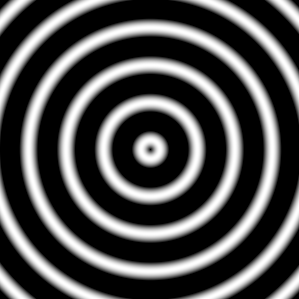
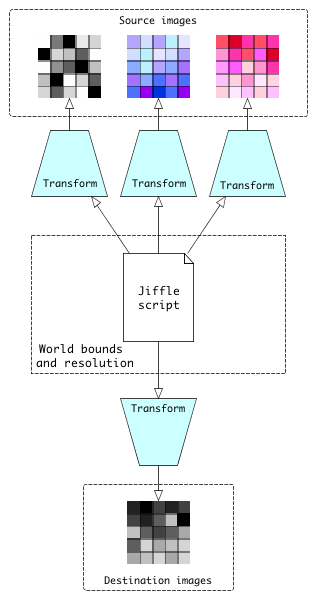

# Jiffle

{:.no_toc}

* Contents
{:toc}

## 15.1 Introduction

Jiffle is a simple scripting language to work with raster images. Its main aim is to let you get more done with less
code.

To illustrate what we mean by that, let's compare a Java method for drawing a simple 3-D mathematical function with an
equivalent Jiffle script.  The function we'll use is this:

```math
z_{x y} = sin( 8 \pi D_{x y} )
```

Where:
    where: ``D_{x y}`` is the distance between pixel position ``(x, y)`` and the image center.

It produces a set of concentric sinusoidal waves which emanate from the image center or, more poetically: *ripples on
the sunlit surface of a still pond...*

<a name="figure-15-1"></a>

------------------------------------------------------------------------



------------------------------------------------------------------------

***Figure 15-1* Ripples

Here is the Java code to plot the function. It uses a ImageN [*]_ iterator to set pixel values. We'll omit the import statements and just
concentrate on the method itself:

```java
    public void createRipplesImage(WritableRenderedImage destImg) {

        // image dimensions
        final int width = destImg.getWidth();
        final int height = destImg.getHeight();

        // first pixel coordinates
        int x = destImg.getMinX();
        int y = destImg.getMinY();

        // center pixel coordinates
        final int xc = x + destImg.getWidth() / 2;
        final int yc = y + destImg.getHeight() / 2;

        // constant term
        double C = Math.PI * 8;

        WritableRectIter iter = RectIterFactory.createWritable(destImg, null);
        do {
            double dy = ((double) (y - yc)) / yc;
            do {
                double dx = ((double) (x - xc)) / xc;
                double d = Math.sqrt(dx * dx + dy * dy);
                iter.setSample(Math.sin(d * C));
                x++;
            } while (!iter.nextPixelDone());

            x = destImg.getMinX();
            y++;
            iter.startPixels();

        } while (!iter.nextLineDone());
    }
```

Now here is the equivalent Jiffle script:

```java
init {
  // image centre coordinates
  xc = width() / 2;
  yc = height() / 2;

  // constant term
  C = M_PI * 8;
}

dx = (x() - xc) / xc;
dy = (y() - yc) / yc;
d = sqrt(dx*dx + dy*dy);

destImg = sin(C * d);
```

Compared to the Java method, the Jiffle script:

* is much shorter
* is easier to read because the algorithm isn't obscured by lots of boiler-plate code
* uses **no** loops !

That last feature is what enables Jiffle scripts to be so concise. In Jiffle, you don't write code to iterate over your
source and destination images. Instead, you specify how to calculate the value of an *individual pixel* and the Jiffle
runtime system then applies that calculation over the whole image.

Now, some readers might cry foul at the above comparison because although we presented the Jiffle script, we didn't show
the necessary Java code to actually run it. To be fair, we didn't show the import statements and calling code necessary
for the Java method either, but in the interest of even-handedness, here is one way to run that script within a Java
program:

```java
        JiffleBuilder builder = new JiffleBuilder();

        // These chained methods read the script from a file,
        // create a new image for the output, and run the script
        builder.script(scriptFile).dest("destImg", 500, 500).run();

        RenderedImage result = builder.getImage("destImg");
```

What you can't do with Jiffle
-----------------------------

Jiffle is an established language, although there are some features that we eventually hope to support are not in there yet.
There are also some constraints imposed by the nature of the Jiffle run-time system.

* Destination images must be data type double (Java DataBuffer.TYPE_DOUBLE). Jiffle does all calculations using double
  values, regardless of the type(s) of source images involved.

* Destination images can only have a single band.

* Jiffle run-time objects iterate through source and destination images by X-ordinate (column), then Y-ordinate (row).
  Algorithms that require a different iteration order, such as the diamond-square method for [generating fractal
  surfaces](https://en.wikipedia.org/wiki/Diamond-square_algorithm) will either be impossible to implement in Jiffle
  or just a lot less work to write directly in Java.

## 15.2 Language summary

### Structure of a Jiffle script

A script consists of the script body, optionally preceded by one or more *special blocks* which are used to declare
variables and control runtime options. We'll return to these blocks later (skip ahead to [special blocks](#special-blocks)
if you  can't wait), but first let's look at the general features of the language.

### Comments

```java
/*
 * C-style block comments
 * are supported
 * in jiffle
 */
```

```java
// As are line comments
```

### Variables

#### Types and variable declaration

Jiffle supports the following types of variables:

**Scalar**
:   A single value. In Jiffle all scalar values correspond to Java type Double.

**Array**
:   A dynamically sized array of scalar values.

**Image**
:   A variables that stands for a source or destination image in a script.

**note**: Support for multi-dimensional arrays is yet to be added.

Jiffle uses lazy declaration for scalar variables. In other words, you can just start using a variable name in the
script body. In this snippet:

```java
  // The variable val required no prior declaration
  val = max(0, image1 - image2);
```

In contrast, array variables must be declared before use so that Jiffle can distinguish them from scalars::

```java
  // declares an empty array 
  foo = [];

  // declares an array with initial values
  bar = [1, 2, 42];
```

Unlike languages such as Ruby, it is invalid to change the type of a variable within a script::

```java
  // Create an array variable
  foo = [1, 2, 3];

  // Now if you try to use it as a scalar you will get a compile-time error
  foo = 42;
  
  // Creating a scalar variable bar, then attempting to do an array operation
  // with it (<< is the append operator) will also make the compiler unhappy
  bar = 42;
  bar << 43; // error
```

#### Variable Names

Variable names must begin with a letter, optionally followed by any combination of letters, digits, underscores and
dots. Letters can be upper or lower case. Variable names are case-sensitive.

See also [reserved words](#reserved-words).

#### Variable Scope <a name="scope"></a>

All scalar and list variables which first appear in the body of the script have *pixel-scope*: their values are
discarded after each destination pixel is processed. Variables declared in the init block, when present, have
*image-scope*: their values persist between pixels::

```java
  init {
      // An image-scope variable with an initial value
      foo = 0;
  }

  // A variable which first appears in the script body
  // has pixel scope
  bar = 0;
```

### Operators

#### Arithmetic operators

 |  Symbol  | Description |
 |:--------:|-------------|
 |  ``^``   | Raise to power |
 |  ``*``   | Multiply    |
 |  ``/ ``  | Divide      |
 |  ``% ``  | Modulo (remainder) |
 |  ``+``   | Add         |
 |  ``-``   | Subtract    |
 |  ``=``   | Assignment  |
 |  ``+=``  | Additive assignment |
 |  ``-=``  | Subtractive assignment |
 |  ``*=``  | Multiplicative assignment |
 |  ``/=``  | Divisive assignment |
 |  ``%=``  | Modulo assignment | 


#### Logical operators

| Symbol  | Description    | 
|:-------:| ---------------|
| ``&&``  |  logical AND |
|   ``||`` |  logical OR |
|  ``^``  |  logical XOR |
| ``==``  |  equality test |
| ``!=``  |  inequality test |
|  ``>``  |  greater than |
| ``>=``  |  greater than or equal to | 
| ``<=``  |  less than |
|  ``<``  |  less than or equal to | 
|  ``!``  |  logical complement |

#### Ternary expression

Example:

```java
  // set foo to 1 if bar > 10; otherwise 0
  foo = bar > 10 ? 1 : 0;
```

See also [logical functions](#logical-functions).

### Control flow

#### If-else statements

You can use the familiar if-else statement in a Jiffle script::

```java
  if (foo > 0) n++ ;

  if (bar == 42) {
    result = 1;
  } else {
    result = 0;
  }
```

#### Loops

One of the features of Jiffle that makes for concise scripts is that you don't need to write the code to loop through
source and destination images because the runtime system does that for you. So many of your scripts will not need any
loop statements. However, Jiffle does provide loop constructs which are useful when working with pixel neighbourhoods or
performing iterative calculations.

#####  foreach loop

Probably most of the times when you need to use a loop in a Jiffle script it will be a foreach loop. The general form
is:

```java
    foreach (*var* in *elements*) *target*
```

where:

**var**
:  is a scalar variable that will be set to each value of *elements* in turn;

**elements**
:  is an array or sequence (see below);
  
**target**
:  is a single statement or a block of code delimited by curly brackets.

This example iterates through a 3x3 pixel neighbourhood and counts the number of values that are greater than a
threshold value. It uses **sequence** notation, which has the form **lowValue:highValue**. Each loop variable is set
to -1, 0, 1 in turn. The loop variables are then used to access a *relative pixel position* in the source image
(see [relative pixel position](#relative-pixel-position):

```java
  // Iterate through pixels in a 3x3 neighbourhood
  n = 0;
  foreach (dy in -1:1) {
      foreach (dx in -1:1) {
          n += srcimage[dx, dy] > someValue;
      }
  }
```

Here is the same example, but this time using the **array** form of the foreach loop:

```java
  // Iterate through pixels in a 3x3 neighbourhood
  delta = [-1, 0, 1];
  n = 0;
  foreach (dy in delta) {
      foreach (dx in delta) {
          n += srcimage[dx, dy] > someValue;
      }
  }
```

##### while loop

A conditional loop which executes the target statement or block while its conditional expression is non-zero:

```java
  ynbr = y() - 500;
  total = 0;
  while (ynbr <= y() + 500) {
      xnbr = x() - 500;
      while (xnbr <= x() + 500) {
          total += srcimage[$xnbr, $ynbr];
          xnbr += 100;
      }
      ynbr += 100;
  }
```

##### until loop

A conditional loop which executes the target statement or block until its conditional expression is non-zero:

```java
  ynbr = y() - 500;
  total = 0;
  until (ynbr > y() + 500) {
      xnbr = x() - 500;
      until (xnbr > x() + 500) {
          total += srcimage[$xnbr, $ynbr];
          xnbr += 100;
      }
      ynbr += 100;
  }
```
##### break and breakif statements

Jiffle provides the **break** statement to unconditionally exit a loop:

```java
  n = 0;
  foreach (i in 1:10) {
      if (foo[i] != null) {
          n++ ;
      } else {
          break;
      }
  }
```

There is also a **breakif** statement:

```java
  n = 0;
  foreach (i in 1:10) {
      breakif(foo[i] == null);
      n++ ;
  }
```

##### Maximum loop iterations

In order to prevent loops from causing excessive resource consumption, Jiffle limits the maximum
number of loop iterations that will be executed before throwing an exception. This limit is applied
per pixel so that it is independent of the source image size. The default value is 200 and the
``org.eclipse.imagen.media.jiffle.maxIterations`` system property can be set to change this limit.
Setting this property to a negative value will disable this limit.

### Functions

##### General numeric functions

| Name                    | Description                                            | Arguments                                | Returns                                                                               |
|-------------------------|--------------------------------------------------------|------------------------------------------|---------------------------------------------------------------------------------------|
| ``abs(x)``              | Absolute value                                         | double value                             | absolute value of x                                                                   | 
| ``acos(x)``             | Arc-cosine                                             | value in range [-1,1]                    | angle in radians                                                                      | 
| ``asin(x)``             | Arc-sine                                               | value in range [-1,1]                    | angle in radians                                                                      |
| ``atan(x)``             | Arc-tangent                                            | value in range [-1,1]                    | angle in radians                                                                      |
| ``atan2(x, y)``         | Arc-tangent                                            | x: double value <br/> y: double value    | converts a rectangular coordinate to polar and returns theta                          |
| ``ceil(x)``             | Ceiling                                                | double value                             | smallest double >=x and is equal to an integer                                        |
| ``cos(x)``              | Cosine                                                 | angle in radians                         | cosine [-1, 1]                                                                        |
| ``degToRad(x)``         | Degrees to radians                                     | angle in radians                         | angle in degrees                                                                      |
| ``exp(x)``              | Exponential                                            | double value                             | e to the power x                                                                      |
| ``floor(x)``            | Floor                                                  | double value                             | integer part of x as a double                                                         |
| ``IEEERemainder(x, y)`` | Remainder                                              | x: double value <br/>y: double value     | remainder of x/y as prescribed by IEEE 754                                            |
| ``isinf(x)``            | Is infinite                                            | double value                             | 1 if x is positive or negative infinity; 0 otherwise                                  |
| ``isnan(x)``            | Is NaN                                                 | double value                             | 1 if x is equal to Java's Double.NaN; 0 otherwise                                     |
| ``isnull(x)``           | Is null, equivalent to isnan(x)                        | double value                             | 1 if x is null; 0 otherwise                                                           |
| ``log(x)``              | Natural logarithm                                      | positive value                           | logarithm to base e                                                                   |
| ``log(x, b)``           | General logarithm                                      | x: positive value <br/> b: base          | logarithm to base b                                                                   |
| ``radToDeg(x)``         | Radian's to degrees                                    | angle in radians                         | angle in degrees                                                                      | 
| ``rand(x)``             | Pseudo-random number, Volatile function                | double value                             | value in range [0, x)                                                                 | 
| ``randInt(x)``          | Pseudo-random number, equivalent to ``floor(rand(x))`` | double value                             | integer part of value in range [0, x)                                                 |
| ``rint(x)``             | Round                                                  | double value                             | rounded value with half values rounded to the nearest even integer                    | 
| ``round(x)``            | Round                                                  | double value                             | rounded value                                                                         |
| ``round(x, n)``         | Round to multiple of n                                 | x: double value;                         | value rounded to nearest multiple of n. <br/> E.g. ``round(44.5, 10)`` returns ``40`` |
| ``sin(x)``              | Sine                                                   | angle in radians                         | sine [-1, 1]                                                                          |
| ``sqrt(x)``             | Square-root                                            | non-negative value                       | square-root of x                                                                      |
| ``tan(x)``              | Tangent                                                | angle in radians                         | double value                                                                          |

##### Logical functions <a name="logical-functions"></a>


| Name                | Description         | Arguments             | Returns                          | 
|---------------------|---------------------|-----------------------|----------------------------------|
| ``con(x)``          | Conditional         | double value          | 1 if x is non-zero; 0 otherwise  |
| ``con(x, a)``       | Conditional         | double values         | a if x is non-zero; 0 otherwise |
| ``con(x, a, b)``    | Conditional         | double values         | a if x is non-zero; b otherwise |
| ``con(x, a, b, c)`` | Conditional         | double values         | a if x is positive; b if x is zero; c if x is negative |


##### Statistical functions


| Name             | Description         |   Arguments          |     Returns |               
|---------------------|---------------------|-----------------------|----------------------------------|
| ``max(x, y)``    | Maximum              | double values          | maximum of x and y |
| ``max(ar)``      | Maximum              | array                  | maximum of array values |
| ``mean(ar)``     | Mean                 | array                  | mean of array values |
| ``min(x, y)``    | Minimum              | double values          | minimum of x and y |
| ``min(ar)``      | Minimum              | array                  | minimum of array values |
| ``median(ar)``   | Median               | array                  | median of array values |
| ``mode(ar)``     | Mode                 | array                  | mode of array values |
| ``range(ar)``    | Range                | array                  | range of array values |
| ``sdev(ar)``     | Standard deviation   | array                  | sample standard deviation of array values |
| ``sum(ar)``      | Sum                  | array                  | sum of array values |
| ``variance(ar)`` | Variance             | array                  | sample variance of array values |

##### Processin|g area functions

| Name          | Returns                                                     |             
|---------------|-------------------------------------------------------------|
| ``height()``  | Height of the processing area (world units)                 |
| ``width()``   | Width of the processing area (world units)                  |
| ``xmin()``    | Minimum X ordinate of the processing area (world units)     |
| ``ymin()``    | Minimum Y ordinate of the processing area (world units)     |
| ``xmax()``    | Maximum X ordinate of the processing area (world units)     |
| ``ymax()``    | Maximum Y ordinate of the processing area (world units)     |
| ``x()``       | X ordinate of the current processing position (world units) |
| ``y()``       | Y ordinate of the current processing position (world units) |
| ``xres()``    | Pixel width (world units)                                   |
| ``yres()``    | Pixel height (world units)                                  |

#### Special blocks <a name="special-blocks"></a>

##### The options block

Used to set options for Jiffle's runtime behaviour. Presently, only the *outside* option is supported. 

For example, this tells Jiffle to return a value of 0 for any pixel value request that falls outside the bounds of the
source image:
```java
  options {
      outside = 0;
  }
```


The following script retrieves the maximum value in a 3x3 kernel centred on each source image and writes it to the
destination image. It uses the outside option to treat kernel locations beyond the source image's edge as null values
which will be ignored by the *max* function:

```java
// This script implements a max filter with a 3x3
// neighbourhood (kernel)

// Set option to treat locations outside the source image
// area as null values
options { outside = null; }

foreach (dy in -1:1) {
    foreach (dx in -1:1) {
        values << src[dx, dy];
    }
}

dest = max(values);
```

If the *outside* option is not set, any request for a value beyond an image's bounds will cause a JiffleRuntimeException.

##### The images block

Used to associate variables with source (read-only) and destination (write-only) images. Example:

```java
  images { 
      foo = read; 
      bar = read;
      result = write; 
  }
```

As shown in the above snippet, the block contains declarations of the form *name = (read | write)*. If this block is
provided, the Jiffle compiler expects that it contains declarations for all image variables used in the script. It not
provided, variable names can be defined as representing source or destination images using methods provided by the
Jiffle and JiffleBuilder classes. These methods are described further in :doc:`runtime`.

##### The init block


This block declares variables that will have *image scope* during processing (as discussed in :ref:`scope`).

Each variable can optionally be assigned an intial value as ``foo`` is here:

```java
  init {
      foo = 42;
      bar;
  }
```

If an initial value is not provided, one must be *injected* at run-time. See XXXX for more details.


Specifying source image position
--------------------------------

Pixel position and image band are specified using square bracket notation.

Absolute pixel position <a name="absolute-pixel-position"></a>
~~~~~~~~~~~~~~~~~~~~~~~

Absolute positions are specified using a ``$`` prefix (similar to the syntax used in some spreadsheet programs):
```java
  // Example: access the value at x=50 y=42
  value = srcimage[ $50, $42 ];
```

Variables and expressions can also appear in the brackets:

```java
  value = srcimage[ $xpos, $(min(width() - 1, y() + 10)) ];
```

Relative pixel position
~~~~~~~~~~~~~~~~~~~~~~~

When values are not prefixed they are treated as offsets, relative to the current processing position:

```java
  // Example: access the value at x+2, y-1
  value = srcimage[ 2, -1 ];
```

As with absolute positions, variables and expressions can also be used:

```java
  value = srcimage[ dx, dy ];
```

Specifying the band 
~~~~~~~~~~~~~~~~~~~

The image band is specified as a single value, variable or expression in square brackets. It is always treated as an
absolute specifier:

```java
  // Get value from band 2 at the current processing position
  value = srcimage[ 2 ];
```

As with pixel position, the band can be specified using a variable or an expression.

Specifying both pixel and band
~~~~~~~~~~~~~~~~~~~~~~~~~~~~~~

When specifying both band and pixel position, the band comes first:

```java
// Get the value for band 1, pixel position x=50, y=42
value = srcimage[ 1 ][ $50, $42 ]

// Get the value for band 1 at offset dx=-1, dy=3
value = srcimage[ 1 ][ -1, 3 ]
```

Reserved words <a name="reserved-words"></a>
--------------

The following are reserved words in Jiffle and may not be used as variable names:

* boolean+
* break
* breakif
* con
* double+
* else
* false
* float+
* foreach
* if
* images
* in
* init
* int+
* null
* options
* read
* true
* until
* while
* write

\+ reserved for future use

## 15.3 The Jiffle run-time system

Once you know how to *write* a Jiffle script, the next thing you'll want to do is *run* it. Jiffle provides a number of
ways to do that. All of them involve these basic steps:

1. Compile your script into a run-time object.
2. Provide the run-time object with source and destination images (and possibly coordinate information)
3. Execute the object.
4. Retrieve the results (images and/or summary values).

Although you write your script in the Jiffle language, you run it from within Java (or possibly another JVM language such
as Groovy).


### Compiling and running scripts with JiffleBuilder

Using JiffleBuilder is the easiest way to get started with Jiffle. Let's look at running the following script:

```java
// This script implements a max filter with a 3x3 neighbourhood (kernel)

// Set option to treat locations outside the source image area as null values
options { outside = null; }
foreach (dy in -1:1) {
    foreach (dx in -1:1) {
        values << src[dx, dy];
    }
}
dest = max(values);
```

This script implements a MAX filter: a 3x3 kernel is placed over each pixel in the input image, represented by the
variable *src*, and the maximum value found is written to the output image, represented by ``dest``.

Now let's look at a Java method which takes the script (in the form of a file) and an input image, and uses
JiffleBuilder to run the script, returning the resulting image to the caller.

```java
public RenderedImage buildAndRunScript(File scriptFile, RenderedImage inputImage) throws JiffleException {

    JiffleBuilder builder = new JiffleBuilder();

    builder.script(scriptFile).source("src", inputImage);
    builder.dest("dest", inputImage.getWidth(), inputImage.getHeight());
    builder.run();

    return builder.getImage("dest");
}
```

## 15.4 Working with coordinate systems

Up until now, the scripts we've been looking at have worked directly with image coordinates, ie. pixel positions. This
chapter introduces the concept of the *processing area*, also referred to as the *world* which allows you to write your
scripts in terms of other coordinate systems such as proportional or geographic distance. You can also use it to deal
with source and destination images that have non-overlapping bounds or different resolutions.

To get the flavour of this, let's look again at the *ripples* script which we saw in the :doc:`introduction`:

```java
init {
  // image centre coordinates
  xc = width() / 2;
  yc = height() / 2;

  // constant term
  C = M_PI * 8;
}

dx = (x() - xc) / xc;
dy = (y() - yc) / yc;
d = sqrt(dx*dx + dy*dy);

destImg = sin(C * d);
```

The variables *dx* and *dy* are the proportional X and Y distances of the current pixel from the image centre *(xc,
yc)*. We use these to calculate the scalar proportional distance *d* which is then fed to the trigonometric function.
You might have noticed that the way this script is written assumes that the image origin is at pixel position *(0, 0)*.
It could be generalized by using the coordinate functions *xmin()*, *ymin()*, *width()* and *height()*.

If we re-write the script to work in proportional coordinates directly, rather than image coordinates, it becomes a lot
simpler:

```java
init {
  // constant term
  C = M_PI * 8;
}

dx = 2 * (x() - 0.5);
dy = 2 * (y() - 0.5);
d = sqrt(dx*dx + dy*dy);

destImg = sin(C * d);
```

We no longer need the variables *xc* and *yc* because the proportional X and Y distances from the image centre are now
simply *2 * (x() - 0.5)* and *2 * (y() - 0.5)* respectively. Also, unlike the previous script, this one will work
equally well with a destination image having a non-zero origin. So working in propoortional coordinates has made the
script both simpler and more general.


### How Jiffle relates image and world coordinates

<a name="figure-15-2"></a>

------------------------------------------------------------------------`



------------------------------------------------------------------------

***Figure 15-2* Jiffle Coordiante Systems**

When a Jiffle script is executed, any calls to coordinate functions such as *x()* (which returns the X ordinate of the
current processing position) or *width()* (which returns the width of the processing area) return values in *world
units*. When reading a value from a source image, or writing a value to a destination image, Jiffle converts the
position from *world coordinates* to a pixel location using the **CoordinateTransform** associated with the image.

Note that CoordinateTransforms are run-time objects. You don't need to worry about the transforms in the script itself.
Instead, you write the script using whatever coordinate system is most appropriate for the application, then provide the
necessary transforms at run-time to convert between world and image coordinates.

If you are working directly with image coordinates in your script you don't need to worry about coordinate transforms
because Jiffle will create a default identity transform for each image automatically. Similarly, if your script makes no
explicit reference to coordinates then, once again, you can simply let Jiffle create the default transforms behind the
scenes.

### Defining the processing area

To execute a script, the Jiffle runtime system needs to know the bounds of the processing area and the pixel dimensions,
both of which are expressed in world units. If you don't supply these explicitly, it will create a default processing
area for you based on the first destination image that was associated with the runtime object or, if there are not
destination images, the first source image. In this case, processing area is simply the image area, and world units will
be equivalent to pixel coordinates.

You can define your own processing area using one of two methods::

// Define bounds and pixel dimensions in world units


### Creating coordinate transforms

The script below reads images representing tree cover in 1990 and 2010 and calculates the proportional change of tree
cover in a 1km block around each pixel. It defines a constant, RADIUS, which is expressed in map units (metres).  The
xres() and yres() functions are used to get the pixel width and height in metres, while the x() and y() functions return
the location (map reference) of the current pixel being processed.

.. literalinclude:: /../src/main/resources/it/geosolutions/jaiext/jiffle/docs/treechange.jfl


If all three images have the same bounds and resolution, we can use a single CoordinateTransform to convert between world locations and image locations:

.. literalinclude:: /../src/main/java/it/geosolutions/jaiext/jiffle/docs/TreeChange.java
:language: java
:start-after: // docs start
:end-before: // docs end

If the images had different bounds and/or resolutions, we would give each its own CoordinateTransform.

## 15.5 Jiffle Tips and Tricks

Cunning plans and clever tricks using Jiffle scripts.

### Jiffle scripts with no destination images

Jiffle allows you to run a script that has no destination images although there must be at least one source image. This
allows you to write scripts which calculate one or more properties from image values. The script below counts how many
values are greater than a threshold value:

```java
init {
  threshold = 10;
  count = 0;
}

count += src > threshold;
```

After running the script, the calling Java code can retrieve the result like this:

```java
Double count = runtimeObj.getVar("count");
```

### Modifying behaviour at run-time

Jiffle allows you to *inject* values for image scope variables at run-time. You can use this to do some nifty things. To
see how this works, let's start with a script that implements a mean filter for a 3x3 kernel:

```java
// Set option to treat locations outside the source image
// area as null values
options { outside = null; }

values = [];
foreach (dy in -1:1) {
  foreach (dx in -1:1) {
      values << src[dx, dy];
  }
}

dest = mean(values);
```

Next, here is the script modified to allow the kernel size to be specified at run-time:

```java
// Set option to treat locations outside the source image
// area as null values
options { outside = null; }

// Specifies kernel size as max distance from target pixel
init { maxd = 1; }

values = [];
foreach (dy in -maxd:maxd) {
  foreach (dx in -maxd:maxd) {
      values << src[dx, dy];
  }
}

dest = mean(values);
```

Now at run-time, we can do this in the calling Java code:

```java
// Specify a 5x5 kernel by setting maxd to 2
runtimeObj.setVar("maxd", 2);
```

### Saving the Java run-time source

The Jiffle compiler translates an input script into a Java source code. After compiling the script you can get a copy of
the generated Java code to examine, modify or compile separately. Here's how to do it with JiffleBuilder:

```java
    public void getSourceFromJiffleBuilder(String script) throws JiffleException {
        JiffleBuilder builder = new JiffleBuilder();
        builder.script(script);

        // Set source and destination parameters, then...

        String runtimeSource = builder.getRuntimeSource();
    }
```

You can also do the same thing when working with a Jiffle object directly:

```java
    public void getSourceFromJiffleObject(String script) throws JiffleException {
    Jiffle jiffle = new Jiffle();
    jiffle.setScript(script);

    // You have to compile the script before getting the runtime
    // source otherwise an Exception will be thrown
    jiffle.compile();

    // Get the Java source. The boolean argument specifies that we
    // want the input script copied into the class javadocs
    String runtimeSource = jiffle.getRuntimeSource(true);
}
```

## 15.6 Jiffle Gotchas

When working with Jiffle, here are some things to avoid:

### Don't depend on pixel processing order

Say you want to create an image with sequential pixel values. Here's one approach::

```java
  // image scope variable
  init { n = 0; }

  // write value to destination image and then increment
  dest = n++ ;
```
There are (at least) two traps waiting to snare you in this innocent looking code. The first is that the resulting image
depends on the order in which pixels are processed, which might not be the order you want. For example, at the time of
writing, a **JiffleDirectRuntime** object's **evaluateAll** method would have processed the pixels by column then row
(although this is deliberately not formalized in the run-time specifications).  Alternatively, your script could have
been executed by some application which instead called the **evaluate(x, y)** method directly and in some other order. 

The second trap has to do with the number of image tiles in the destination image, especially if the script is being
passed to a JAITools **JiffleOpImage**  for execution as part of an image rendering chain. In that case, the value of n
written to a pixel depends on which tile that pixel belongs to, and the order in which the tiles are processed.

So, unless you have complete control over the execution of the script, it's safer to specify how the values will be
ordered in the script itself. 

This script will give values ordered by column, then row:

```java
  dest = x() + width() * y();
```

While this script gives values ordered by row, then column:
```java
  dest = y() + x() * height();
```

## 15.7 Jiffle glossary

**Image scope** <a name="image-scope"></a>
:   Refers to variables whose values persist throughout processing. You create an image-scope variable by declaring it
within the [init block](#init-block).

    See also [pixel scope](#pixel-scope)

**affine transformation**
:   Geometric image transformation, such as translation, scaling, or
rotation.

**init block** <a name="init-block"></a>
:   A script element used to declare non-image variables that will have :ref:`image scope <#image-scope>`. It takes the
following form:

    ```java
        init {
            foo = 0;
            bar = 2 * M_PI + sqrt(42);
            baz;
        }
    ```
    
    The init block is optional. When present, it must precede the body of the script and appear after the options block.
    There can only be one init block.

***pixel scope*** <a name="pixel-scope"></a>
:  This is the default scope for non-image variables. Any value assigned to a pixel-scope variable is lost after each
pixel is processed.

   See also [image scope](#image-scope).

***runtime object*** <a name="runtime-object"></a>
:  The executable version of a Jiffle script. This is a [POJO](https://en.wikipedia.org/wiki/Plain_old_Java_object) that
implements the JiffleRuntime interface.

